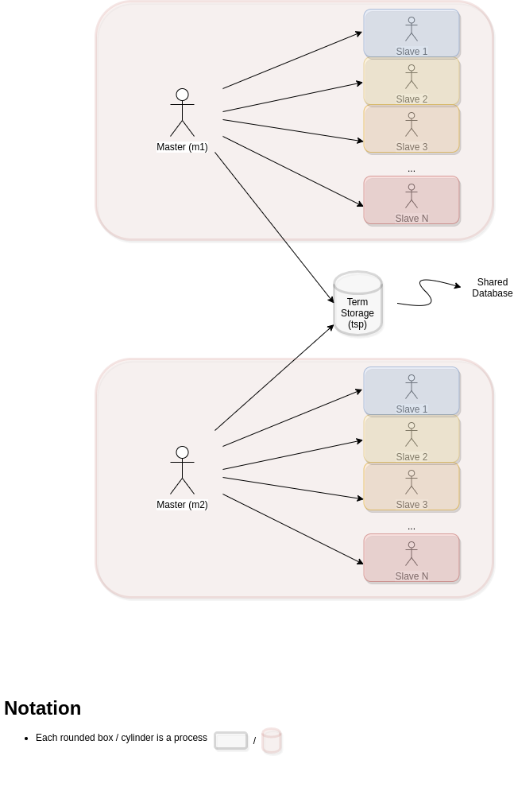

# Work Distribution Master-Slaves

In order to conceive a solution for the given problem, modularity and SRP (Single Responsibility Principle) principles were taken in consideration. That being said, four modules were conceived, being three of these the main actors/concepts of the solution respectively, `Master`, `Slave` and `Term Storage`. The fourth module is `Work Distribution` is acts as the program main. Master was conceived to permit multiple instances of it in the Erlang VM, in order to have multiple masters to communicate as seen in Figure 1. Each master has its own slaves that receive and reply requests to compute the prime numbers of an array. This array is a parcel of a bigger array which master has previously received as request to compute its prime numbers. Term Storage is a shared database of `terms`, that uses the process term dictionary (key-value schema) as the data storage. Its a singleton in the Erlang VM which allows communication under the alias `tsp`. Although that the term storage is a shared database, it keeps data consistency betwen multiple acessors with the same key, as it always stores terms as tuples (`{Pid, Key}`) using the requester Pid (process identifier). Master's use Term Storage in order to store the Pid of their slaves and the composition of the remaning requests of the prime computation.



<center>Figure 1 - GPNL Diagram illustrating the overview of the solution</center>

## Communication Interfaces

All communication is asynchronous using messages between processes, except for `term_storage` in which the module functions are used, which are blocking calls.

**Master**

|Actor|Receives|Replies|Description|
|-----|--------|-----|-----------|
|Master users|`{FromPid, {spawn_slaves, N}}`|`{Master, ok}`|Indicates master to spawn **N** new slaves|
|Master users|`{FromPid, {compute_prime, Integers}}`|`{Master, ok}`|Requests master the sum of all prime numbers in the array `Integers` (prime computation)|
|Master slaves|`{FromPid, {result_compute_prime_slave, Result, UUID}}`|`{Master, ok}`|Receives the result of a parcel prime computation|

**Slave**

|Actor|Receives|Replies|Description|
|-----|--------|-----|-----------|
|Master|`{FromPid, {compute_prime_slave, Integers, UUID}}`|`{Pid, {result_compute_prime_slave, Result, UUID}}`|Receives a prime computation request|

**Term Storage**

|Actor|Receives|Replies|Description|
|-----|--------|-----|-----------|
|Term Storage users|`{FromPid, {store, Key, Value}}`|`{tsp, Value}`|Receives request to store a value identified by `Key`|
|Term Storage users|`{FromPid, {remove, Key}}`|`{tsp, ok}`|Receives request to delete the value identified by `Key`|
|Term Storage users|`{FromPid, {lookup, Key}}`|`{tsp, Value}`|Receives request to retrieve the value identified by `Key`|

**Work Distributon**

|Actor|Receives|Replies|Description|
|-----|--------|-----|-----------|
|Master|`{result_compute_prime, ResultComputePrime}`|--|Receives result of a prime computation|


## Future Improvements

The current load-balancing algorithm (split integers array in parcels) works but has no optimizations regarding the array length and other factors such as available slaves number.

## Run

Open erlang shell and paste the following:

```
c('./master.erl').
c('./slave.erl').
c('./prime_operations.erl').
c('./term_storage.erl').
c('./work_distribution.erl').

work_distribution:load_test().
```